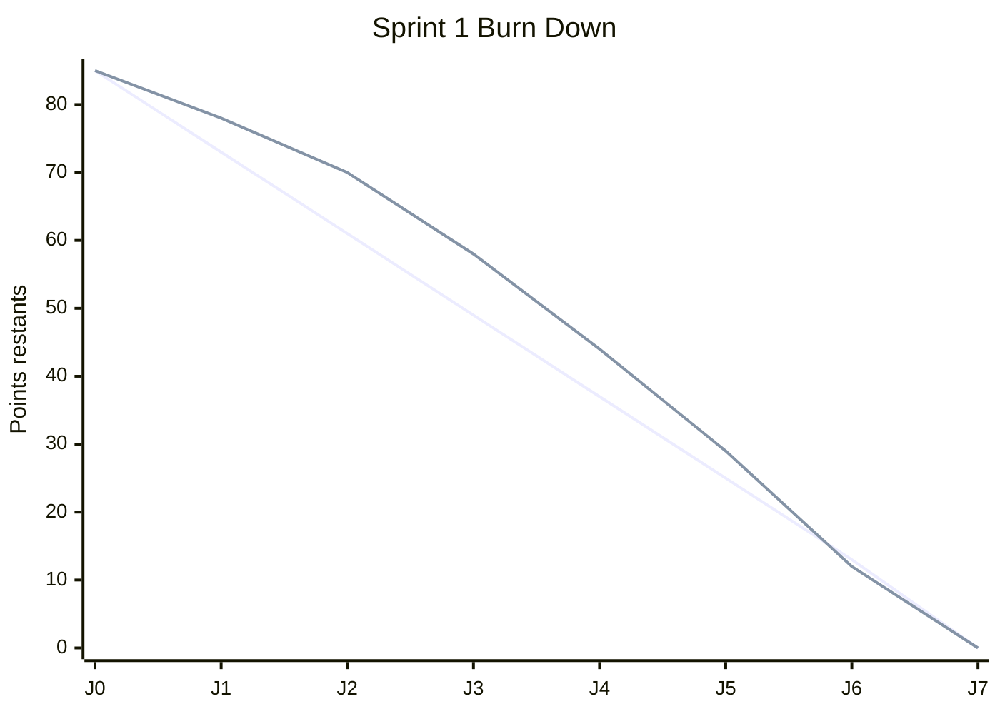

# Burn Down Chart - Sprint 1

## Parametres
- Capacite sprint: 85 points
- Duree: 7 jours ouvrables (J0 a J7)
- Debut: 2026-03-02
- Fin: 2026-03-09

## Tableau de suivi

| Jour | Date | Restant ideal | Restant reel | Ecart (Reel - Ideal) |
|---|---:|---:|---:|---:|
| J0 | 2026-03-02 | 85 | 85 | 0 |
| J1 | 2026-03-03 | 73 | 78 | +5 |
| J2 | 2026-03-04 | 61 | 70 | +9 |
| J3 | 2026-03-05 | 49 | 58 | +9 |
| J4 | 2026-03-06 | 37 | 44 | +7 |
| J5 | 2026-03-07 | 25 | 29 | +4 |
| J6 | 2026-03-08 | 13 | 12 | -1 |
| J7 | 2026-03-09 | 0 | 0 | 0 |

## Interpretation
- Debut de sprint plus lent que la trajectoire ideale (J1 a J5).
- Acceleration en fin de sprint avec rattrapage (J6).
- Objectif atteint a la fin du sprint (0 point restant a J7).

## Graphique Mermaid (optionnel)

