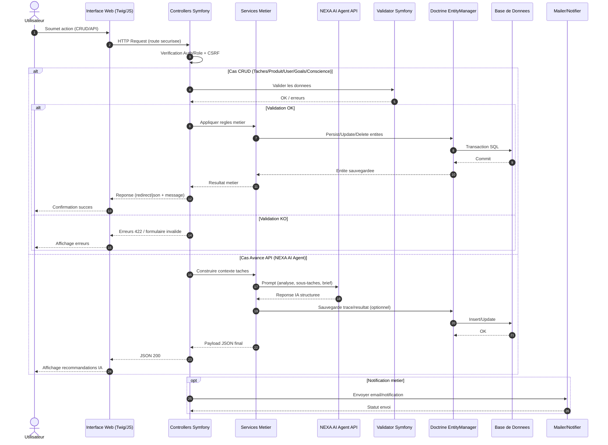

# Diagramme de Sequence Objet Global - Sprint 1

## Note de lecture
- Le diagramme couvre le flux global de toutes les gestions du Sprint 1.
- Les deux branches principales sont: CRUD classique et API avancee NEXA AI Agent.
- Les controles transverses (authentification, validation, persistance) sont mutualises.
